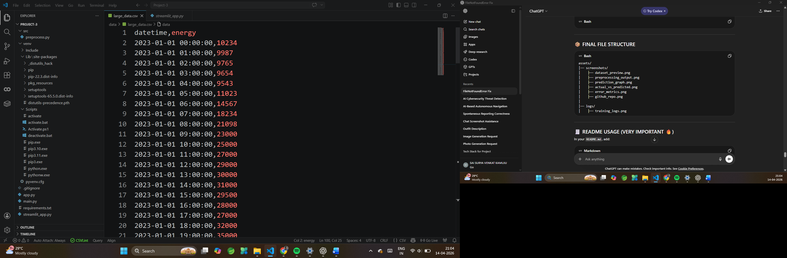
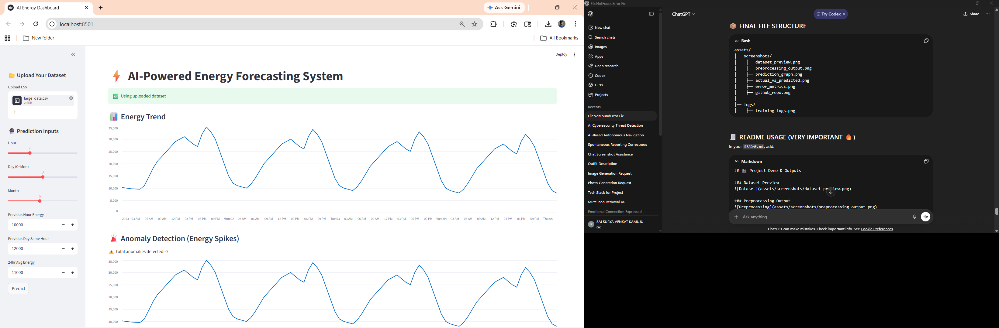
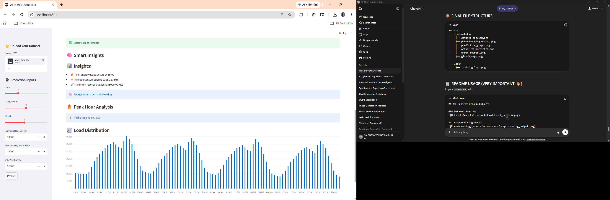
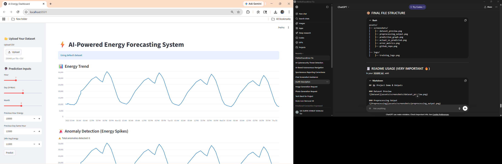
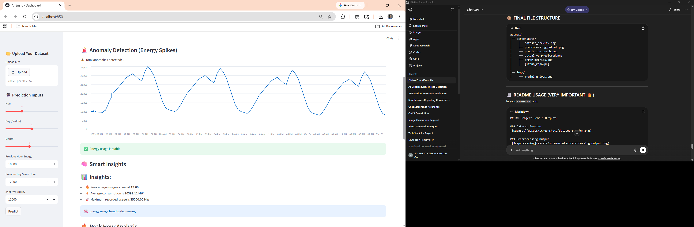
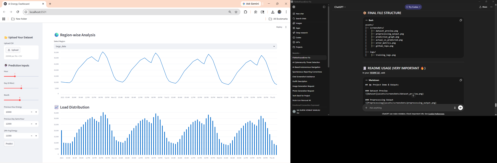

# 🛡️ AI-Powered Cybersecurity Threat Detection System


---

## 📌 Overview

The **AI-Powered Cybersecurity Threat Detection System** is a full-stack project designed to detect malicious network activities using **Machine Learning and Anomaly Detection techniques**.

This system simulates a **real-world Security Operations Center (SOC)** by analyzing network traffic, identifying threats, and generating alerts through a **Flask API and Streamlit dashboard**.

---

## ❗ Problem Statement

Cybersecurity threats are rapidly evolving, and traditional rule-based systems often fail to detect:

* Unknown attacks
* Zero-day vulnerabilities
* Anomalous traffic patterns

There is a need for an **intelligent, scalable system** that can:

* Detect known threats using ML
* Identify unknown anomalies
* Provide real-time alerts and insights

---

## 🏭 Industry Relevance

This project replicates real-world cybersecurity tools such as:

* Intrusion Detection Systems (IDS)
* Security Information and Event Management (SIEM) systems
* SOC dashboards

### 💼 Applications:

* Enterprise network monitoring
* Threat intelligence platforms
* Incident response systems
* Cybersecurity analytics

---

## 🧠 Tech Stack

### 🔹 Programming

* Python

### 🔹 Machine Learning

* Scikit-learn (Random Forest, Isolation Forest)

### 🔹 Data Processing

* Pandas, NumPy

### 🔹 Visualization

* Matplotlib, Seaborn, Plotly

### 🔹 Backend

* Flask API

### 🔹 Frontend

* Streamlit Dashboard

### 🔹 Tools

* Git, GitHub

---

## 📊 Dataset

* Dataset Used: **NSL-KDD**
* Type: Simulated network traffic dataset
* Contains:

  * Normal traffic
  * DoS attacks
  * Probe attacks
  * Intrusion attempts

### 📌 Key Features:

* duration
* protocol_type
* service
* src_bytes
* dst_bytes
* count
* serror_rate

---

## 🏗️ Architecture

```id="0s3rd3"
[User Input / CSV Upload]
            ↓
   [Streamlit Dashboard]
            ↓ (HTTP Request)
        [Flask API]
            ↓
   [Scaler + ML Model]
            ↓
[Threat Detection + Classification]
            ↓
   [Alerts + JSON Response]
            ↓
   [Dashboard Visualization]
```

---

## ⚙️ Installation

### 🔹 Clone Repository

```bash
git clone https://github.com/your-username/AI-Cybersecurity-Threat-Detection-System.git
cd AI-Cybersecurity-Threat-Detection-System
```

---

### 🔹 Create Virtual Environment

```bash
python -m venv venv
venv\Scripts\activate   # Windows
```

---

### 🔹 Install Dependencies

```bash
pip install -r requirements.txt
```

---

## ▶️ Usage

---

### 🚀 Run Flask API

```bash
cd api
py app.py
```

👉 Runs at:

```
http://127.0.0.1:5000/
```

---

### 📊 Run Dashboard

```bash
cd ..
python -m streamlit run dashboard/app.py
```

👉 Runs at:

```
http://localhost:8501
```

---

### 📁 Optional: Upload CSV

* Upload `test_large_network_data.csv`
* Perform batch threat detection

---

## 📈 Results

* Achieved **~90–95% accuracy** on classification
* Successfully detected:

  * DoS attacks
  * Network scans
  * Anomalous traffic

### ✅ Outputs:

* Threat classification
* Severity levels
* Real-time alerts
* Bulk CSV analysis

---

## 📸 Screenshots

### 📊 Dataset Preview




### DataSet Based Output





### 🛡️ Dashboard





### 📊 Bulk Analysis


---

## 🎯 Learning Outcomes

* ✅ Understanding of cybersecurity threat patterns
* ✅ Implementation of ML-based intrusion detection
* ✅ Experience with anomaly detection techniques
* ✅ Full-stack integration (Flask + Streamlit)
* ✅ API development and real-time systems
* ✅ GitHub project structuring and documentation

---

## 🚀 Future Improvements

* Real-time packet capture integration
* Deep learning models (LSTM / Autoencoders)
* Cloud deployment (AWS / Render)
* Advanced SOC dashboard UI
* User authentication system

---

## 📜 License

This project is licensed under the MIT License - see the [LICENSE](LICENSE) file for details.

---

## 💼 Author

**Sai Surya Venkat Kamuju**
Software Engineer

---

## ⭐ Support

If you found this project useful, please ⭐ the repository!
