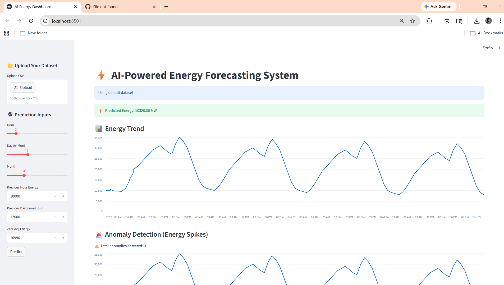
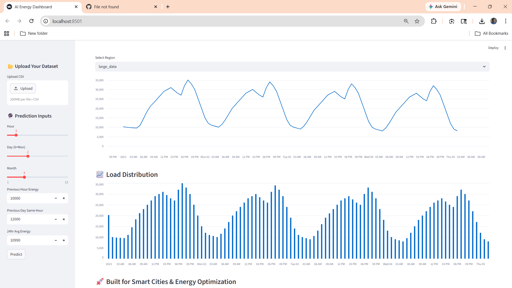
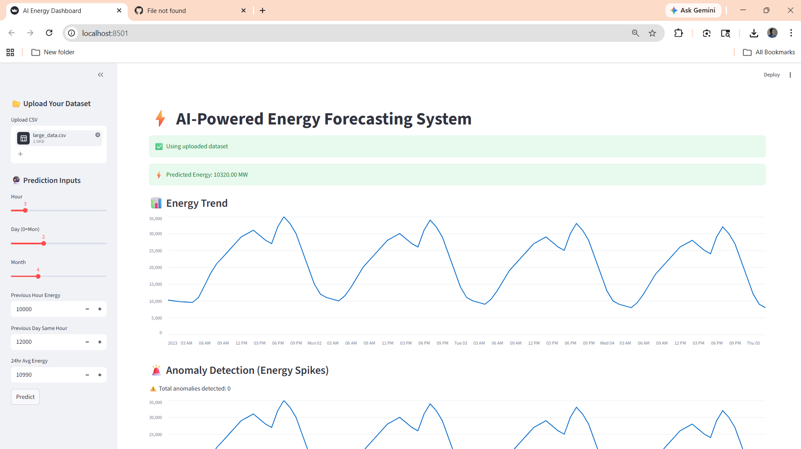
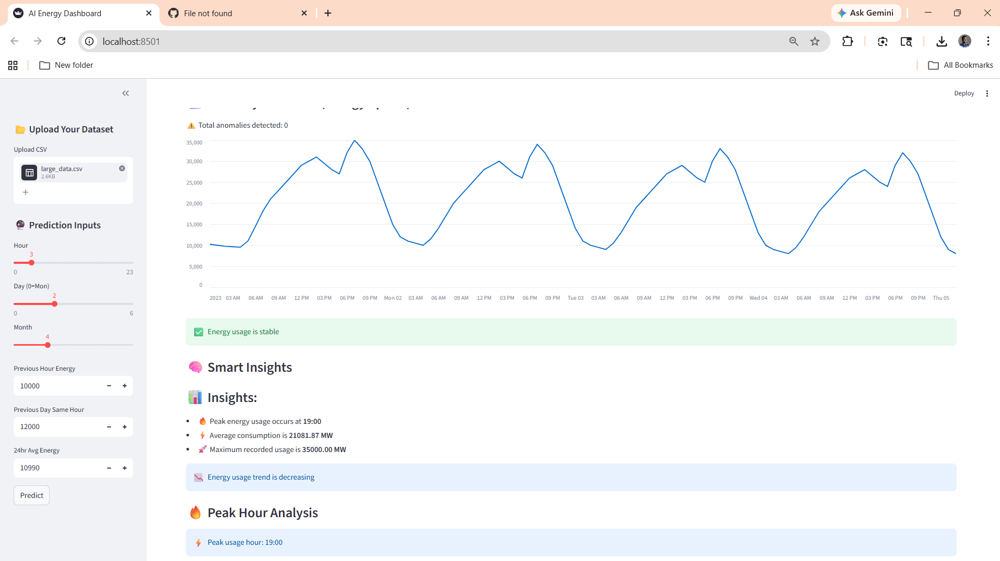
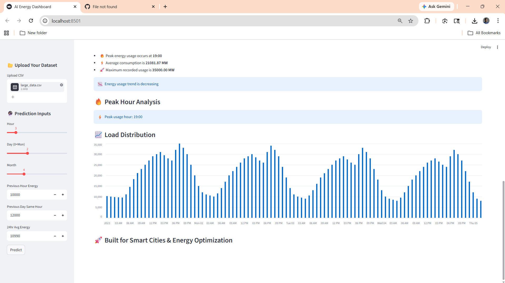

# AI-Powered Energy Forecasting System

A machine learning project for forecasting energy usage from time-series CSV data, with:
- a training pipeline,
- a Flask prediction API,
- and a Streamlit dashboard for interactive analysis.

## Project Structure

- `main.py`: End-to-end training pipeline (load data, preprocess, feature engineering, train, evaluate, save model, plots).
- `app.py`: Flask API for model inference (`/predict`).
- `streamlit_app.py`: Dashboard for prediction, anomaly detection, and insights.
- `src/`: Core modules (`data_loader`, `preprocess`, `feature_engineering`, `model`, `evaluate`, `anomaly`).
- `data/`: Input CSV files.
- `models/`: Saved model artifacts.
- `outputs/`: Generated plots from training.

## Requirements

- Python 3.10+ recommended
- Pip

Install dependencies:

```bash
pip install -r requirements.txt
```

### Screenshots of the project

### Dataset Preview


### Dashboard



### DataSet Output




## Data Expectations

The loader scans all CSV files in `data/` and expects:
- one datetime-like column (name containing `datetime`),
- one energy column (renamed internally to `Energy`).

Each file is treated as a region and merged into one dataset.

## Run the Project

### 1. Train the Model

```bash
python main.py
```

This will:
- train the forecasting model,
- print metrics (RMSE and R2),
- save model to `models/energy_model.pkl`,
- save plots to `outputs/time_series.png` and `outputs/actual_vs_pred.png`.

### 2. Start the Streamlit Dashboard

```bash
python -m streamlit run streamlit_app.py
```

Default local URL is usually:
- `http://localhost:8501`

If port 8501 is busy, Streamlit may use another port (for example 8502).

### 3. Start the Flask API (Optional)

```bash
python app.py
```

API runs at:
- `http://127.0.0.1:5000/`

## API Usage

### Health

`GET /`

Example response:

```json
{
  "message": "Energy Forecasting API Running",
  "status": "OK"
}
```

### Prediction

`POST /predict`

Request JSON:

```json
{
  "hour": 12,
  "day": 3,
  "month": 6,
  "lag_1": 10000,
  "lag_24": 12000,
  "rolling_mean_24": 11000
}
```

Response JSON:

```json
{
  "predicted_energy": 10543.27,
  "timestamp": "2026-04-15 13:45:02.123456",
  "status": "success"
}
```

## Dashboard Features

- Manual prediction via sidebar inputs
- CSV upload for custom data
- Energy trend visualization
- Basic anomaly detection (z-score style thresholding)
- Peak-hour and summary insights
- Region-wise view (when default data includes region labels)

## Troubleshooting

- If dashboard/API says model is missing, run `python main.py` first.
- If Streamlit port is occupied, use the URL shown in terminal.
- If dependencies fail to install, confirm your Python/pip path and virtual environment activation.

## License

See `LICENSE`.
